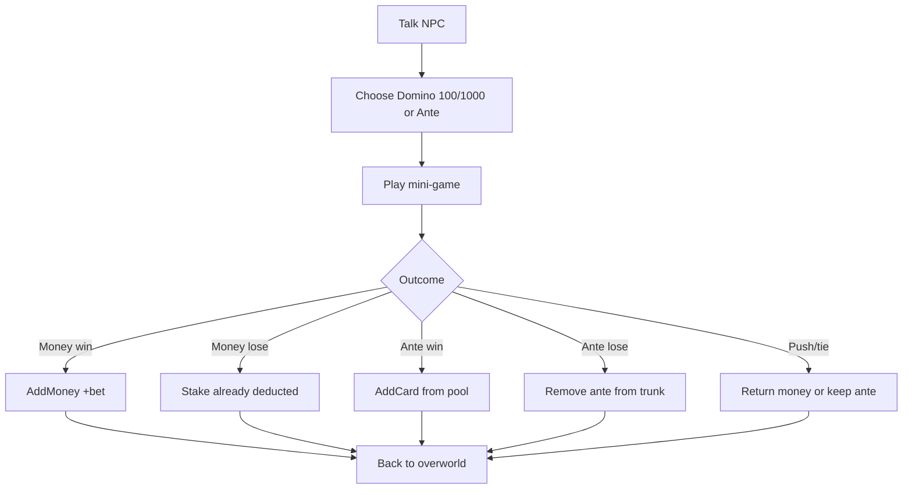

# Domino Boat Casino Mini-Games

## Shared design (locked)

| Item | Decision |
|------|----------|
| Hosts | Dealer → Blackjack; Patron → Concentration; **replace** map 25 dialogue |
| Money stakes | Choose **100** or **1000** Domino; win pays **1:1** (net +bet; stake returned + winnings) |
| Ante stakes | Any trunk card; **lose removes** it (duel ante style); **win** = random from prize pool |
| Prize pools | `!IsNormalAnte(ante)` → secondary pool; else primary. Reuse [`src/ante.c`](src/ante.c) `sLowLevelAnte` / `IsNormalAnte` |
| After round | Resolve payout → return to overworld (talk again to replay) |
| Prize pool content | **Stub tables** (shared by both games); fill card IDs later |

## Blackjack (Dealer)

- **Cards:** real monster IDs with `level` 1–11 only; level **11 = Ace** (11 unless bust → 1). No level 12+.
- **Shoe:** infinite — each draw picks a random eligible monster (level then random ID of that level, or equivalent).
- **Rules (minimal):** hit/stand only; dealer stands on all 17s; one hole card until player done; no double/split/insurance; natural pays **1:1**; **push** returns stake.
- **UI:** dedicated overlay (ante-viewer pattern): mini-cards via `sub_80573D0` / face-down via `CopyFaceDownCardTiles`; show running totals.

## Concentration (Patron)

- **Board:** 4×5 = 10 pairs; match = **same card ID**; pairs = random monsters from full DB.
- **Turns:** strict alternate (no extra turn on match); player first.
- **Win:** clear board → compare match counts; higher wins pot; **tie = push**.
- **AI (fair-ish):** remembers seen face-up cards; takes a known match if available; else random unknown tiles.
- **VRAM:** all face-down share card-back tiles; only the **two** currently revealed load mini-art (then clear/re-back on mismatch).

## Implementation approach

### Entry / scripts

- Replace dealer/patron talk scripts in [`events/scripts/map_25_state_01.c`](events/scripts/map_25_state_01.c) (and state_02/03 mirrors if they duplicate the same A/R texts).
- Flow: short offer text → stake choice → launch C mini-game → exit to overworld.
- Prefer a **new SPECIAL** (or thin script→C bridge) that starts the game after choices are recorded; stake UI can live in C (cleaner than encoding trunk ante pick in event macros). Pattern references: [`documentation/ante-card-viewer.md`](documentation/ante-card-viewer.md), [`src_custom/overworld_hooks.c`](src_custom/overworld_hooks.c) `OverworldRestoreAfterDebugMenu`.

### Code layout (new, under `src_custom/`)

- `casino/` (or `minigames/`): shared stake/payout + two game modules + stub prize-pool data.
- LynJump / overworld hook only as needed for SPECIAL or ProcessInput launch; keep vanilla `src/` clean.
- Optional `gRuntimeConfig` toggles to disable games.

### Stakes / economy

- Domino: deduct 100/1000 up front; on win `AddMoney` same amount again; on push refund.
- Ante: lock selected trunk card at start; on lose remove (mirror duel ante); on win `AddCard` from pool; on push unlock/keep.
- Pool pick: `IsNormalAnte(ante) == FALSE` → secondary stub list; else primary.

### Docs / validation

- Short design note under `documentation/` (FogStages-style via documentation skill if writing full docs).
- Narrow host self-check for Ace soft-total / Concentration match counting if non-trivial.
- `make` per validate-before-reply after edits.

## Out of scope (v1)

- Freeform Domino amounts beyond 100/1000
- Double/split/insurance, finite shoe, blackjack 3:2
- Mid-game quit/forfeit
- Play-again prompt (re-talk only)
- Filled prize-pool balancing (stubs only)
