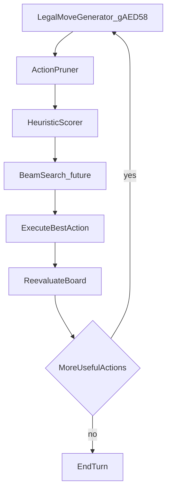

# Fast AI Architecture Design Doc

## Goal

Write a FogStages-style design doc that adapts the external Reshef AI advice to this repo: what already matches, what `fast_ai` currently does, and a staged target architecture for later implementation.

**No code, no runtime toggles, no beam/search changes in this pass.**

## Deliverable

New file: [`documentation/fast-ai-architecture.md`](documentation/fast-ai-architecture.md)

Style: same sections as [`documentation/smarter-ai.md`](documentation/smarter-ai.md) / documentation-style skill (title, index, introduction, plan, code locations, TODO, limitations).

Cross-links:
- Point from the new doc to [`documentation/smarter-ai.md`](documentation/smarter-ai.md) (tactical modifiers / picker — orthogonal concern)
- Optionally add one line in [`ARCHITECTURE.md`](ARCHITECTURE.md) “Where to look” for AI (fast AI vs smarter AI)

## Doc content (locked)

### Introduction

- Reshef has no rigid Main/Battle/End phases; [`AI_Main__Replacement`](src_custom/ai_main_hooks.c) already loops: sim → pick → execute → reevaluate until pass.
- Modern mechanics explode branching; exhaustive search is wrong for GBA.
- Today’s `fast_ai` ([`configs/runtime.c`](configs/runtime.c) + [`src_custom/ai_sim_fast.c`](src_custom/ai_sim_fast.c)) is a **sim budget** (quick-reject + 8 full / 16 light caps + early stop), not the full target architecture.
- `enable_smarter_ai` is a separate post-sim picker; keep scopes distinct.

### Plan — target pipeline (diagram + stages)

Map advice → repo reality:

| Advice piece | Current | Target (later code) |
|--------------|---------|---------------------|
| Avoid exhaustive search | Caps in `ai_sim_fast.c` | Keep budget; prefer quality over completeness |
| Generate legal actions | `gAED58` + legality (`0x0801A08C`) | Same generator; extend as new summon types need actions |
| Aggressive prune | `AiSimFastQuickReject` | Expand reject rules (wasteful tribute, no-target activate, noop loops) |
| Score actions | Vanilla priority from sim | Keep vanilla scores initially; optional lightweight heuristic pre-rank before sim |
| Beam search | Not present (greedy early-stop) | Shallow beam depth 2–3 on top-N (future) |
| Board-state loop | Already `AI_Main` | Keep; do not invent phase AI |
| Combo packages | Not present | Treat known lines (e.g. Poly + materials) as one high-level action (future) |
| Incremental board eval | Full save/restore sim | Delta scoring after simulated action (future perf) |

Staged implementation roadmap in TODO only (not built now):

1. **Prune hardening** — extend `AiSimFastQuickReject` + document reject classes
2. **Pre-rank / keep top-N** — score cheaply, then full-sim only survivors (still one action deep)
3. **Shallow beam** — multi-step lookahead with existing save/restore
4. **Combo packages** — archetype / Extra Deck lines
5. **Incremental eval** — only if profiling shows board score cost dominates

### Code Locations

Document the current stack accurately:

| Feature | Location | Description |
|---------|----------|-------------|
| Runtime toggle | `fast_ai` in `configs/runtime.h` / `.c` | Cap sim work |
| Turn loop | `AI_Main__Replacement` in `src_custom/ai_main_hooks.c` | Board-state action loop |
| Fast sim | `AiSimulateAllCandidateActionsFast` in `src_custom/ai_sim_fast.c` | Prune + budgeted sims |
| Full sim wrapper | `AiSimulateAllCandidateActions` in `src_custom/ai_hooks.c` | Dispatches fast vs exhaustive |
| Action pick | `sub_800EF0C__Replacement` / `AiDecision_PickAction` | Force activates + picker |
| Action table | `gAED58` / `tools/generate_ai_action_table.py` | Legal action templates |

### TODO / Limitations

- Explicit: this doc is the contract; code follows after agreement.
- Note that Synchro/Xyz/Link/Pendulum in the external advice are future mechanics; prune/score/combo sections must stay extensible.
- Note known `fast_ai` pitfalls from session logs (pass-turn empty zone2, activate-before-attack order, sim flag restore) so implementers do not regress them.
- Invite playtest reports with duelist/turn/board when behavior changes later.

## Out of scope this pass

- No edits to `ai_sim_fast.c`, beam search, combo tables, or runtime defaults
- No merge of `enable_smarter_ai` into `fast_ai`
- No host tests beyond what docs need (none)

## Session log

After the doc lands, append a short entry to [`documentation/session_logs/2026-07-18.md`](documentation/session_logs/2026-07-18.md) and refresh [`documentation/CARD_STATE.md`](documentation/CARD_STATE.md).
