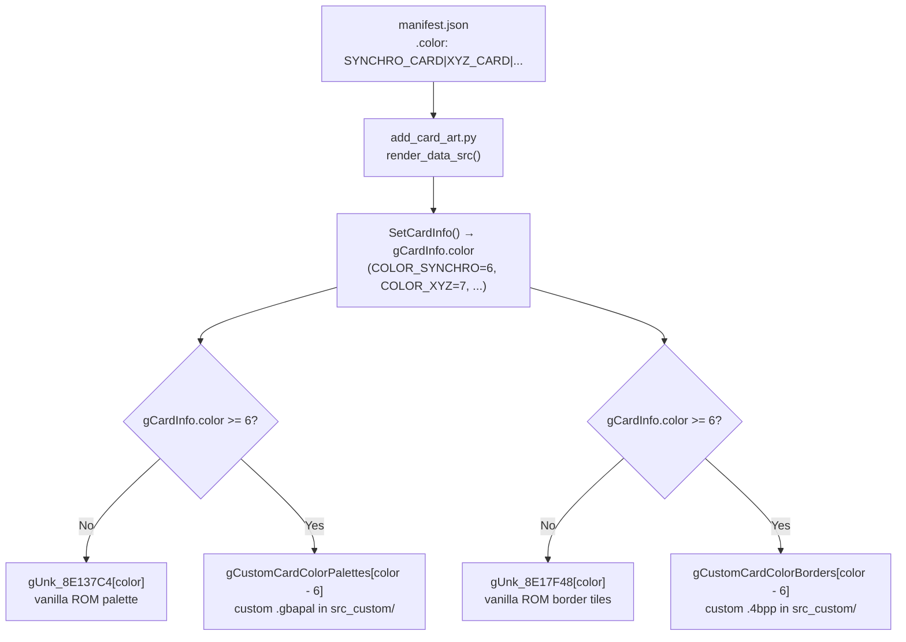

# New Card Colors Framework (Synchro, XYZ, Pendulum, Link)

## Architecture

New card colors are added as entries in the `CardColor` enum. At runtime, a LynJump hook on the two rendering paths (big card palette and mini card border) redirects color indices >= 6 to custom asset data in `src_custom/`. Vanilla ROM arrays (`gUnk_8E137C4`, `gUnk_8E17F48`) are left untouched.

## Steps

### 1. Expand the CardColor enum

- Add `COLOR_SYNCHRO`, `COLOR_XYZ`, `COLOR_PENDULUM`, `COLOR_LINK` after `COLOR_RITUAL` (before the god card entries) in `include/card.h` enum `CardColor`
- Add matching `#define` constants (`SYNCHRO_CARD 6`, `XYZ_CARD 7`, `PENDULUM_CARD 8`, `LINK_CARD 9`) in `include/constants/card_enums.h`
- Bump `NUM_COLORS` from 9 to 13

### 2. Update the manifest generator

- Add the new color defines (`SYNCHRO_CARD`, `XYZ_CARD`, `PENDULUM_CARD`, `LINK_CARD`) to the `#define` block in `tools/add_card_art.py` `render_data_src()` (line ~1236)
- Cards in `tools/card_data_manifest.json` can now use `"color": "SYNCHRO_CARD"` etc.

### 3. Hook the big-card color palette (sub_80267E0)

- Create `src_custom/card_color_hooks.c` with:
  - `gCustomCardColorPalettes[]` — an array of 4 `unsigned short*` pointers to `.gbapal` files (one per new color, 40 bytes each)
  - LynJump replacement for `sub_80267E0`: when `gCardInfo.color >= 6`, copy from `gCustomCardColorPalettes[color - 6]` instead of `gUnk_8E137C4[color]`; otherwise chain to vanilla
- Wire the LynJump in `src_custom/LynJump.event`
- Create placeholder `.gbapal` palette files in `src_custom/assets/cards/frames/` (e.g., `synchro.gbapal`, `xyz.gbapal`, `pendulum.gbapal`, `link.gbapal`)

### 4. Hook the mini-card border tiles (sub_80573D0, sub_805742C)

- Extend the existing hooks in `src_custom/mini_card_hooks.c` (`sub_80573D0__Replacement`, `sub_805742C__Replacement`) to check `gCardInfo.color >= 6`
- For new colors, use `gCustomCardColorBorders[color - 6]` instead of `gUnk_8E17F48[color]`
- `gCustomCardColorBorders[]` — an array of 4 `unsigned char*` pointers to border tile data
- Create placeholder `.4bpp` border tile files

### 5. Create fallback palette data (temporary, until real art)

- Each `.gbapal` file: 20 RGB555 halfwords (40 bytes). Use the closest vanilla color as a starting point:
  - `synchro.gbapal` → white/silver (reuse Fusion palette, which is violet, as placeholder structure)
  - `xyz.gbapal` → black/dark
  - `pendulum.gbapal` → orange/green gradient (reuse Normal/Earth palette as placeholder structure)
  - `link.gbapal` → blue (reuse Spell palette, which is green, as placeholder structure)
- Each `.4bpp` border tile file: reuse existing border data from the vanilla entries as placeholder (can be refined later)

### 6. Runtime toggle (optional)

- Add `enable_new_card_colors` to `configs/runtime.h` and `configs/runtime.c`
- When FALSE, the hooks pass through to vanilla behavior even for new color indices

### 7. Validate

- Run `python3 tools/add_card_art.py --card-ids` to verify the generator
- Run `make test-cards-build` to verify the full build links
- If a test card uses a new color, confirm it doesn't crash the card detail view or field display
