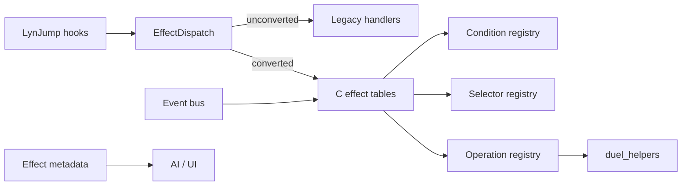

# Effect Data System

---

## Index

- [Introduction](#introduction)
- [Plan](#plan)
- [Code Locations](#code-locations)
- [TODO](#todo)
- [Limitations & Bugs](#limitations--bugs)

## Introduction

Custom card effects today are **one C file per card** wired through LynJump hooks and ad hoc field/battle notifies. That cleared the stub backlog, but left ~874 **partial** ceilings in [`PARTIAL_EFFECTS.md`](PARTIAL_EFFECTS.md): the card body exists, yet a shared engine piece (OPT reset, destroy listener, Damage Step hook, continuous stat applier, …) does not.

Player-facing goal: keep the game playable while new cards get cheaper to add — prefer **reusable operations + events + metadata** over another thousand bespoke handlers.

Design goal: introduce a **data-driven effect layer** beside the legacy path. Unconverted cards keep working through existing handlers. Converted cards express behavior as ordered ops with conditions/selectors, and trigger cards subscribe to events instead of being polled or special-cased in `Duel_Check*AfterFieldChange`.

Related living lists:

- Stubs: [`STUB_EFFECTS.md`](STUB_EFFECTS.md) (TODO bodies — currently empty)
- Partials: [`PARTIAL_EFFECTS.md`](PARTIAL_EFFECTS.md) (`ponytail:` ceilings)
- Taxonomy: [`PARTIAL_EFFECTS_TAXONOMY.md`](PARTIAL_EFFECTS_TAXONOMY.md) (ceilings tagged by missing surface)

## Plan

### Encoding policy (locked)

| Stage | Format | Rule |
|-------|--------|------|
| **Now (2A)** | Hand-authored ROM **C tables** / small `.inc` | Same spirit as spell dispatch and permanent override tables. Runtime is C only. |
| **Later (2B)** | JSON manifest → codegen | Generator emits the **identical** C table layout. |

**Freeze gate before 2B:** do not introduce JSON authoring until Phase 1–3 opcodes and event names stop churning. Premature schemas force constant generator rewrites.

### Target shape

- **Dispatcher** — called from existing spell / trap / monster / permanent / turn / battle entrypoints; defaults to legacy.
- **Operations** — parameterized wrappers over [`duel_helpers.h`](../include/duel_helpers.h) (`Op_Draw(n)`, not `Draw2()`).
- **Conditions / selectors** — reusable predicates and target pickers.
- **Event bus** — subscribers for summon, destroy, battle-destroy, damage-calc, Standby, leave-field (replaces hard-coded notify chains over time).
- **Metadata** — category, timing, targeting, params, speed, OPT flags for AI/UI.

### Migration phases

| Phase | Goal | Unblocks PARTIAL cluster | Notes |
|------:|------|--------------------------|-------|
| 0 | `EffectDispatch(cardId, ctx)` → legacy | Foundation | Thin adapters in existing `*_hooks.c` |
| 1 | Op registry over `duel_helpers` | Search / draw / mill composition | Pilots: `one_day_of_peace`, `d_burst`, `grand_convergence` |
| 2 | Condition + selector registries | Choice / targeting debt | Share PickZone filters |
| 3 | Event bus + generic OPT clear on Standby | OPT (~largest), summon, destroy, battle, GY ignition | Highest ROI vs PARTIAL taxonomy |
| 4 | Effect scripts = ordered op sequences + metadata | Simple new cards without new `.c` | **2A C tables** |
| 4b | JSON → codegen same tables | Volume authoring | **2B after freeze gate** |
| 5 | AI reads metadata categories | Semantic ranking beyond action index | Extend `ai_decision/`; legacy fallback |

### How PARTIAL_EFFECTS feeds priority

Ceilings are missing **engine surfaces**, not missing card stubs. Work Phase 3 (events + OPT) before mass card rewrites. Tagging lives in [`PARTIAL_EFFECTS_TAXONOMY.md`](PARTIAL_EFFECTS_TAXONOMY.md); regenerate with `--write-list`.

### Compatibility rules

1. Unconverted card IDs always hit legacy handlers.
2. A converted card may keep a thin `.c` escape hatch for one-off text the op set cannot express.
3. Do not edit vanilla `src/` effect tables beyond LynJump entrypoints.
4. Removing a `ponytail:` requires the missing surface to exist — do not “fix” PARTIAL rows by deleting comments.

### Non-goals (early phases)

- Full TCG chain / Speed rules
- Rewriting all partials in one pass
- Runtime JSON / scripting VM on GBA
- Perfect print-accurate OPT for every card before a generic OPT primitive exists

## Code Locations

| Feature | Location | Description |
|--------|----------|-------------|
| Living partials | [`PARTIAL_EFFECTS.md`](PARTIAL_EFFECTS.md) | Auto from `ponytail:` via `stub_effect_queue.py --write-list` |
| Partial taxonomy | [`PARTIAL_EFFECTS_TAXONOMY.md`](PARTIAL_EFFECTS_TAXONOMY.md) | Same scan, tagged by missing event/op |
| Stub backlog | [`STUB_EFFECTS.md`](STUB_EFFECTS.md) | TODO effect bodies |
| Reusable ops today | `Duel_*` in [`duel_helpers.h`](../include/duel_helpers.h) / [`duel_helpers.c`](../src_custom/duel_helpers.c) | Draw, destroy, mill, discard, LP, search, summon, PickZone |
| Spell dispatch | [`spell_effect_hooks.c`](../src_custom/spell_effect_hooks.c) | Generated ID switch + vanilla table |
| Permanent overrides | [`permanent_effect_hooks.c`](../src_custom/permanent_effect_hooks.c) | `sPermanentEffectOverrides[]` |
| Turn overrides | [`turn_effect_hooks.c`](../src_custom/turn_effect_hooks.c) | `sTurnEffectOverrides[]` |
| Ad hoc field notifies | `Duel_NotifyMonsterZoneChanged` in `duel_helpers.c` | Hard-coded `Duel_Check*AfterFieldChange` — Phase 3 migration target |
| Smarter AI today | [`smarter-ai.md`](smarter-ai.md) / `src_custom/ai_decision/` | Action categories, not effect semantics |
| Planned system root | `src_custom/effect_system/` | Dispatch, ops, conditions, selectors, events, metadata |
| Phase 0 dispatch | `EffectDispatch_TryActivate` / `QueryShouldActivate` in [`effect_dispatch.c`](../src_custom/effect_system/effect_dispatch.c) | Empty conversion table → always legacy |
| Phase 0 header | [`effect_system.h`](../include/effect_system.h) | Kinds + result codes |
| Phase 1 ops | `Op_*` / `EffectOp_Run` in [`effect_ops.h`](../include/effect_ops.h) / [`effect_ops.c`](../src_custom/effect_system/effect_ops.c) | Draw, mill, destroy, LP, search-by-id |
| Phase 1 pilots | `one_day_of_peace.c`, `d_burst.c`, `grand_convergence.c` | Compose via `Op_*` |
| Phase 2 conditions | [`effect_conditions.h`](../include/effect_conditions.h) / [`effect_conditions.c`](../src_custom/effect_system/effect_conditions.c) | Opp S/T, face-up spell, opp monster, … |
| Phase 2 selectors | [`effect_selectors.h`](../include/effect_selectors.h) / [`effect_selectors.c`](../src_custom/effect_system/effect_selectors.c) | First/exists on field; AI first-match |
| Phase 2 pilots | `d_burst.c`, `dragon_spirit_of_white.c` | Shared PickZone validators |
| Phase 3 events | [`effect_events.h`](../include/effect_events.h) / [`effect_events.c`](../src_custom/effect_system/effect_events.c) | Subscribe/Emit + OPT |
| Phase 3 emit sites | `duel_helpers.c`, `battle_damage_hooks.c`, `turn_effect_hooks.c` | Summon / destroy / battle-destroy / turn boundary |
| Phase 3 OPT pilots | `amazoness_call.c`, `d_burst.c` | `EffectOpt_*` cleared on turn boundary |
| Phase 4 scripts | [`effect_scripts.h`](../include/effect_scripts.h) / [`effect_scripts.c`](../src_custom/effect_system/effect_scripts.c) | Ordered op steps + metadata |
| Phase 4 pilots | One Day of Peace, Pot of Greed, Grand Convergence | Routed via `EffectDispatch` → `EffectScript_Run` |
| Phase 5 AI meta | `EffectMeta_GetCategory` + `AiMod_EffectSemantics` in [`ai_modifiers.c`](../src_custom/ai_decision/ai_modifiers.c) | Semantic activate nudges; legacy spellEffect fallback |
| Phase 4b generator | [`tools/generate_effect_scripts.py`](../tools/generate_effect_scripts.py) + [`tools/effect_scripts_manifest.json`](../tools/effect_scripts_manifest.json) | Emits `src_custom/generated/effect_scripts_table.inc` |
| Field continuous | `EFFECT_EVENT_ON_FIELD_CHANGE` → Rivalry / Level Limit / Amazoness / Ring | Notify / DestroyZone / battle GY / PostBoardScan emit |
| Damage-calc event | `EFFECT_EVENT_ON_DAMAGE_CALC` → Skyscraper + Inferno ATK boosts | Emit from `RefreshPendingBattleActionStatsFromZones` |
| Burn scripts | `EFFECT_SCRIPT_BURN_THROUGH_TRAPS` | Sparks…Tremendous Fire, Meteor |

## TODO

- [x] Phase 0: dispatcher + legacy fallback wired beside spell/trap/monster/permanent/turn hooks
- [x] Phase 1: `Op_*` registry wrapping existing `Duel_*` helpers; 1–3 composition pilots
- [x] Phase 2: condition + selector registries
- [x] Phase 3: event bus; replace notify chain incrementally; generic OPT Standby clear
- [x] Phase 4: C-table effect scripts for a handful of simple cards
- [x] Phase 4b: JSON manifest → codegen (after opcode/event freeze)
- [x] Phase 5: AI metadata consumption with legacy fallback
- [x] Keep taxonomy regenerated whenever `--write-list` runs
- [x] Migrate remaining `*UsedThisTurn` APPEND_DATA flags to `EffectOpt_*`
- [x] Emit `ON_DAMAGE_CALC` from damage-calc Apply sites; subscribe continuous triggers to events instead of `Duel_Check*AfterFieldChange`
- [x] Grow script table; add condition/selector step ops for targeting cards
- [x] Expand legacy `spellEffect` → meta map as more vanilla effects matter to AI
- [x] Thin redundant `Duel_Check*AfterFieldChange` call sites that already emit field/summon/leave events
- [x] Grow more scripts in the JSON manifest; migrate burn/heal LynJump spells carefully (own trap LP path)
- [x] Subscribe damage-calc continuous ATK boosts to `ON_DAMAGE_CALC` instead of only Apply* chains
- [ ] Heal LynJump spells (Mooyan Curry family) via a heal-through-traps step
- [ ] More damage-calc subscribers beyond Skyscraper / Inferno
- [ ] More JSON scripts (draw/search/simple destroy)

## Limitations & Bugs

- Until Phase 3, continuous/trigger ceilings in PARTIAL_EFFECTS will keep growing as agents implement stand-in bodies.
- C-table scripts (2A) still need merge discipline; they do not by themselves make “thousands of cards” cheap — that is the 2B authoring step.
- Heal LynJump spells that pass trap LP via `Duel_TryResolveSpellThroughTrapsEx` still need a dedicated step op (burns use `BURN_THROUGH_TRAPS`).
- Metadata for AI is useless until categories are stable and populated; do not block Phases 0–3 on AI work.
- Report gaps (missing taxonomy tags, wrong Phase ROI) against this doc or the taxonomy file.
