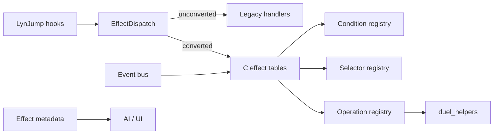

# Effect Data System

---

## Index

- [Introduction](#introduction)
- [Plan](#plan)
- [Code Locations](#code-locations)
- [TODO](#todo)
- [Limitations & Bugs](#limitations--bugs)

## Introduction

Custom card effects today are **one C file per card** wired through LynJump hooks and ad hoc field/battle notifies. That cleared the stub backlog, but left ~874 **partial** ceilings in [`PARTIAL_EFFECTS.md`](PARTIAL_EFFECTS.md): the card body exists, yet a shared engine piece (OPT reset, destroy listener, Damage Step hook, continuous stat applier, …) does not.

Player-facing goal: keep the game playable while new cards get cheaper to add — prefer **reusable operations + events + metadata** over another thousand bespoke handlers.

Design goal: introduce a **data-driven effect layer** beside the legacy path. Unconverted cards keep working through existing handlers. Converted cards express behavior as ordered ops with conditions/selectors, and trigger cards subscribe to events instead of being polled or special-cased in `Duel_Check*AfterFieldChange`.

Related living lists:

- Stubs: [`STUB_EFFECTS.md`](STUB_EFFECTS.md) (TODO bodies — currently empty)
- Partials: [`PARTIAL_EFFECTS.md`](PARTIAL_EFFECTS.md) (`ponytail:` ceilings)
- Taxonomy: [`PARTIAL_EFFECTS_TAXONOMY.md`](PARTIAL_EFFECTS_TAXONOMY.md) (ceilings tagged by missing surface)

## Plan

### Encoding policy (locked)

| Stage | Format | Rule |
|-------|--------|------|
| **Now (2A)** | Hand-authored ROM **C tables** / small `.inc` | Same spirit as spell dispatch and permanent override tables. Runtime is C only. |
| **Later (2B)** | JSON manifest → codegen | Generator emits the **identical** C table layout. |

**Freeze gate before 2B:** do not introduce JSON authoring until Phase 1–3 opcodes and event names stop churning. Premature schemas force constant generator rewrites.

### Target shape

- **Dispatcher** — called from existing spell / trap / monster / permanent / turn / battle entrypoints; defaults to legacy.
- **Operations** — parameterized wrappers over [`duel_helpers.h`](../include/duel_helpers.h) (`Op_Draw(n)`, not `Draw2()`).
- **Conditions / selectors** — reusable predicates and target pickers.
- **Event bus** — subscribers for summon, destroy, battle-destroy, damage-calc, Standby, leave-field (replaces hard-coded notify chains over time).
- **Metadata** — category, timing, targeting, params, speed, OPT flags for AI/UI.

### Migration phases

| Phase | Goal | Unblocks PARTIAL cluster | Notes |
|------:|------|--------------------------|-------|
| 0 | `EffectDispatch(cardId, ctx)` → legacy | Foundation | Thin adapters in existing `*_hooks.c` |
| 1 | Op registry over `duel_helpers` | Search / draw / mill composition | Pilots: `one_day_of_peace`, `d_burst`, `grand_convergence` |
| 2 | Condition + selector registries | Choice / targeting debt | Share PickZone filters |
| 3 | Event bus + generic OPT clear on Standby | OPT (~largest), summon, destroy, battle, GY ignition | Highest ROI vs PARTIAL taxonomy |
| 4 | Effect scripts = ordered op sequences + metadata | Simple new cards without new `.c` | **2A C tables** |
| 4b | JSON → codegen same tables | Volume authoring | **2B after freeze gate** |
| 5 | AI reads metadata categories | Semantic ranking beyond action index | Extend `ai_decision/`; legacy fallback |

### How PARTIAL_EFFECTS feeds priority

Ceilings are missing **engine surfaces**, not missing card stubs. Work Phase 3 (events + OPT) before mass card rewrites. Tagging lives in [`PARTIAL_EFFECTS_TAXONOMY.md`](PARTIAL_EFFECTS_TAXONOMY.md); regenerate with `--write-list`.

**Fast clear order (no per-card LynJump):**

1. **List registers** — `GetSpellType` NORMAL (face-up OPT) / EQUIP + `IsActiveDynamicEquipSpellZone` (+ destroy-on-leave beside Premature Burial). One switch case clears many `equip.Register` / re-activate ceilings.
2. **CCTO row** — `Cond_*` / `Op_*` in the card file + one `sEffectsExtra[]` TRIGGER/CONTINUOUS (or `sGyIgnitionTable` entry). Use `EFFECT_FLAG_OPT` + existing emits; do not add a new LynJump per card.
3. **Script activate** — simple draw/burn/destroy → `effect_scripts_manifest.json` (codegen), not a new `.c` body.
4. **Escape hatch** — only when text cannot share an event/op.

Do not delete `ponytail:` until the surface exists. Do not clone summon/destroy/battle hooks into each spell file.

### Compatibility rules

1. Unconverted card IDs always hit legacy handlers.
2. A converted card may keep a thin `.c` escape hatch for one-off text the op set cannot express.
3. Do not edit vanilla `src/` effect tables beyond LynJump entrypoints.
4. Removing a `ponytail:` requires the missing surface to exist — do not “fix” PARTIAL rows by deleting comments.

### Non-goals (early phases)

- Full TCG chain / Speed rules
- Rewriting all partials in one pass
- Runtime JSON / scripting VM on GBA
- Perfect print-accurate OPT for every card before a generic OPT primitive exists

## Code Locations

| Feature | Location | Description |
|--------|----------|-------------|
| Living partials | [`PARTIAL_EFFECTS.md`](PARTIAL_EFFECTS.md) | Auto from `ponytail:` via `stub_effect_queue.py --write-list` |
| Partial taxonomy | [`PARTIAL_EFFECTS_TAXONOMY.md`](PARTIAL_EFFECTS_TAXONOMY.md) | Same scan, tagged by missing event/op |
| Stub backlog | [`STUB_EFFECTS.md`](STUB_EFFECTS.md) | TODO effect bodies |
| Reusable ops today | `Duel_*` in [`duel_helpers.h`](../include/duel_helpers.h) / [`duel_helpers.c`](../src_custom/duel_helpers.c) | Draw, destroy, mill, discard, LP, search, summon, PickZone |
| Spell dispatch | [`spell_effect_hooks.c`](../src_custom/spell_effect_hooks.c) | Generated ID switch + vanilla table |
| Permanent overrides | [`permanent_effect_hooks.c`](../src_custom/permanent_effect_hooks.c) | `sPermanentEffectOverrides[]` |
| Turn overrides | [`turn_effect_hooks.c`](../src_custom/turn_effect_hooks.c) | `sTurnEffectOverrides[]` |
| Ad hoc field notifies | `Duel_NotifyMonsterZoneChanged` in `duel_helpers.c` | Hard-coded `Duel_Check*AfterFieldChange` — Phase 3 migration target |
| Smarter AI today | [`smarter-ai.md`](smarter-ai.md) / `src_custom/ai_decision/` | Action categories, not effect semantics |
| Planned system root | `src_custom/effect_system/` | Dispatch, ops, conditions, selectors, events, metadata |
| **Effect CCTO (uniform)** | [`effect.h`](../include/effect.h) / [`effect.c`](../src_custom/effect_system/effect.c) | YGOPRO-shaped type+code+cond/cost/target/op; activate + events |
| Generated Effect rows | [`effect_registry.inc`](../src_custom/generated/effect_registry.inc) | One ACTIVATE Effect per JSON script (`EffectOp_RunScript`) |
| Phase 0 dispatch | `EffectDispatch_*` → `Effect_TryActivate` / `QueryShouldActivate` | Converted → CCTO; else legacy |
| Phase 0 header | [`effect_system.h`](../include/effect_system.h) | Kinds + result codes |
| Phase 1 ops | `Op_*` / `EffectOp_Run` in [`effect_ops.h`](../include/effect_ops.h) / [`effect_ops.c`](../src_custom/effect_system/effect_ops.c) | Draw, mill, destroy, LP, search-by-id |
| Phase 1 pilots | `one_day_of_peace.c`, `d_burst.c`, `grand_convergence.c` | Compose via `Op_*` |
| Phase 2 conditions | [`effect_conditions.h`](../include/effect_conditions.h) / [`effect_conditions.c`](../src_custom/effect_system/effect_conditions.c) | Opp S/T, face-up spell, opp monster, … |
| Phase 2 selectors | [`effect_selectors.h`](../include/effect_selectors.h) / [`effect_selectors.c`](../src_custom/effect_system/effect_selectors.c) | First/exists on field; AI first-match |
| Phase 2 pilots | `d_burst.c`, `dragon_spirit_of_white.c` | Shared PickZone validators |
| Phase 3 events | [`effect_events.h`](../include/effect_events.h) / [`effect_events.c`](../src_custom/effect_system/effect_events.c) | Subscribe/Emit + OPT; `Emit` → `Effect_DispatchEvent` |
| Phase 3 emit sites | `duel_helpers.c`, `battle_damage_hooks.c`, `turn_effect_hooks.c`, `spell_effect_hooks.c` | Summon / destroy / battle-destroy / turn boundary / LP / card activate |
| Phase 3 OPT pilots | `amazoness_call.c`, `d_burst.c` | `EffectOpt_*` cleared on turn boundary |
| Phase 3+ LP / activate | `EFFECT_EVENT_ON_LP_GAIN`/`ON_LP_LOSS`/`ON_CARD_ACTIVATE` + negate latch | `Duel_ChangeLp` → `EmitLpChange`; activate → `EmitCardActivate` + `ConsumeActivationNegate` |
| Phase 3+ LP pilots | `aroma_lp_gain.c` (Bergamot / Cananga / Jasmine) | OPT via `EffectOpt_*` on LP gain |
| Phase 4 scripts | [`effect_scripts.h`](../include/effect_scripts.h) / [`effect_scripts.c`](../src_custom/effect_system/effect_scripts.c) | Step tables = **operation backend** for ACTIVATE Effects |
| Phase 4 pilots | One Day of Peace, Pot of Greed, Grand Convergence | Routed via CCTO → `EffectOp_RunScript` |
| Phase 5 AI meta | `EffectMeta_GetCategory` + `AiMod_EffectSemantics` in [`ai_modifiers.c`](../src_custom/ai_decision/ai_modifiers.c) | Prefers `Effect_GetCategory`; legacy fallback |
| Phase 4b generator | [`tools/generate_effect_scripts.py`](../tools/generate_effect_scripts.py) + manifest | Emits scripts table **and** Effect registry |
| Field continuous | `EFFECT_EVENT_ON_FIELD_CHANGE` → Rivalry / Level Limit / Amazoness / Ring | Still `EffectEvent_Subscribe` handlers |
| Damage-calc continuous | CCTO `EFFECT_TYPE_CONTINUOUS` + `ON_DAMAGE_CALC` | Inferno / Skyscraper / Fighting Spirit in `sEffectsExtra` |
| Burn scripts | `EFFECT_SCRIPT_BURN_THROUGH_TRAPS` | Sparks…Tremendous Fire, Meteor |
| Heal scripts | `EFFECT_SCRIPT_HEAL_THROUGH_TRAPS` | Mooyan Curry…Dian Keto |
| Destroy/search scripts | Dark Hole, Raigeki, Fusion Sage, type-wipes, Feather Duster | |
| LP scripts | Goblin Thief / Upstart / Rain of Mercy through-traps ops | |
| Battle destroy | Continuous Destruction Punch | Des Kangaroo-style pending |

## Uniform format (CCTO)

Public shape for converted effects (YGOPRO Structure of a card script, in C):

- `type` — ACTIVATE / TRIGGER / CONTINUOUS  
- `code` — `EFFECT_CODE_ACTIVATE` or `EFFECT_EVENT_*`  
- `condition` / `cost` / `target` / `operation` — function pointers (`EffectCheckFn` / `EffectResolveFn`)  

No Lua/VM. JSON scripts remain optional codegen for simple activate **steps**; complex cards use a custom `operation` on the same `struct Effect`. Unconverted LynJump cards stay legacy until wrapped.

## Working agreement

- Prefer **≥10 script/effect items per pass** for effect-data work — avoid drip 1–3 card sessions unless debugging.
- New converted cards: register `struct Effect` (hand or generated). Do not invent a second public format.

## TODO

- [x] Phase 0–5 and prior follow-ups (see history above)
- [x] Large type-wipe / LP / Punch batch (30 scripts)
- [x] CCTO core + registry bridge for all scripted activates + damage-calc continuous
- [x] Heavy Storm / Final Destiny / Crush Card pack (+8 board/LP spells → 41 scripts)
- [x] Custom ID≥801 CCTO pack (14 continuous/resolve → 55 scripts)
- [x] Phase 3+ bus: `ON_LP_GAIN` / `ON_LP_LOSS` / `ON_CARD_ACTIVATE` + activation-negate latch (Aroma LP pilots)
- [ ] Migrate remaining LynJump/custom effects onto `struct Effect` rows (escape hatch = custom op)
- [ ] Next ≥10: coin/draw/discard composites (Cup of Ace, Graceful Charity, Card Destruction) or OPT/battle surfaces
- [ ] Full TCG-style chain / Speed (still non-goal for early phases; activate latch is lightweight only)
- [ ] Extra Deck model (Xyz / Link / Synchro) — deferred engine surface

## Limitations & Bugs

- Activate/query/has/category use a **cardId-sorted index** (binary search); event dispatch uses **per-event lists**. Built once in `EnsureIndexes`. Empty `EFFECT_KIND_*` still early-out via kind-presence bits.
- **Stat overlay performance:** `ApplyFieldZoneStatsToCardInfo` may call dozens of `Apply*` helpers per monster. New continuous ATK/DEF overlays **must** use `Duel_FindBackrowCard*` / `Duel_IsBackrowCardOnField` (face-up) so they hit `Duel_BeginFaceUpBackrowCache`, and must check field presence **before** `Duel_CardNameContains` / `SetCardInfo`. Do not hand-loop both backrows inside an overlay. Rule: `.cursor/rules/stat-overlay-perf.mdc`.
- Continuous/trigger ceilings in PARTIAL_EFFECTS shrink as Phase 3+ surfaces land; Extra Deck / full chain remain deferred.
- C-table scripts (2A) still need merge discipline; they do not by themselves make “thousands of cards” cheap — that is the 2B authoring step.
- Burn/heal script args must not stash in `APPEND_DATA` (ROM) — use `Duel_TryResolveBurn/HealSpellThroughTraps` helpers.
- Metadata for AI is useless until categories are stable and populated; do not block Phases 0–3 on AI work.
- Report gaps (missing taxonomy tags, wrong Phase ROI) against this doc or the taxonomy file.
- Further damage-calc subscribers (Supreme King's Castle OPT send, piercing, etc.) remain card-specific battle_effects work.
- CCTO does **not** mean every card is converted — only registry rows + legacy fallthrough.
- `EffectCondFn` / `EffectOpFn` in conditions/ops headers are **opcode registries**; CCTO uses `EffectCheckFn` / `EffectResolveFn` to avoid the name clash.
- `ON_CARD_ACTIVATE` + `RequestActivationNegate` is a one-shot latch before resolve — not a multi-link chain.
