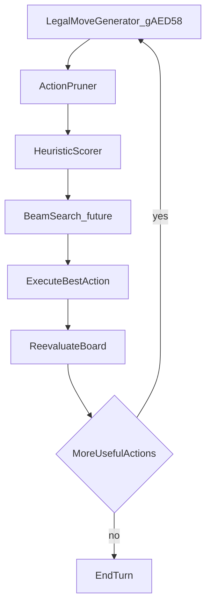

# Fast AI Architecture

---

## Index

- [Introduction](#introduction)
- [Plan](#plan)
- [Code Locations](#code-locations)
- [TODO](#todo)
- [Limitations & Bugs](#limitations--bugs)

## Introduction

*Reshef of Destruction* has no rigid Main / Battle / End phases. The opponent may act in flexible order until they pass. That fits a **board-state loop** better than phase-based AI: generate legal actions, prune and score them, execute the best one, then reevaluate until ending the turn is better than any remaining play.

Modern summoning and effect stacks explode the branching factor. Exhaustive search of every legal sequence is impractical on GBA hardware. The goal is **high-quality decisions under a budget**, not perfect play.

Today’s `fast_ai` toggle in [`configs/runtime.c`](../configs/runtime.c) runs a **heuristic-only** decision path in [`src_custom/ai_sim_fast.c`](../src_custom/ai_sim_fast.c): prune → score top-N → legality-check survivors → pick highest score. It does **not** save/execute/restore duel state, and skips post-batch GFX / graveyard resync. Target: well under 60 frames per decision. Shallow beam, combo packages, and incremental board eval remain future stages when quality needs a budgeted sim again.

[`enable_smarter_ai`](smarter-ai.md) is a separate concern: post-sim tactical modifiers and variance among near-optimal lines. Do not merge those scopes.

## Plan

### Current turn loop (already Reshef-shaped)

[`AI_Main__Replacement`](../src_custom/ai_main_hooks.c) already implements the board-state loop:

1. Simulate candidate actions (`AiSimulateAllCandidateActions`, optionally fast path).
2. Pick one action (`sub_800EF0C__Replacement` → force activates / `AiDecision_PickAction`).
3. Execute it.
4. Run permanent effects / win checks.
5. Repeat until the picker returns pass (end turn).

No Main/Battle/End phase AI should be introduced.

### Target decision pipeline

| Stage | Role |
|-------|------|
| Legal move generator | Enumerate candidates from `gAED58[]` and vanilla legality |
| Action pruner | Discard obviously bad / impossible lines before expensive sim |
| Heuristic scorer | Cheap category+ATK pre-rank chooses what to sim; vanilla sim priority still picks the play |
| Beam search | Keep top-N multi-step futures (not built yet; greedy early-stop today) |
| Execute best action | Real play via existing execute hooks |
| Reevaluate board | Loop back through `AI_Main` until pass |

### Advice mapped to this repo

| Advice piece | Current | Target (later code) |
|--------------|---------|---------------------|
| Avoid exhaustive search | Heuristic-only top-12; no execute sims | Optional budgeted sim only if quality regressions demand it |
| Generate legal actions | `gAED58` + legality on top-N only | Same generator; extend as new summon types need actions |
| Aggressive prune | `AiSimFastQuickReject` + reject-class table below | Further reject classes as new mechanics land |
| Score actions | Cheap board heuristic → priority table | Refine weights; optional light sim for ties |
| Beam search | Not present | Shallow beam depth 2–3 on top-N |
| Board-state loop | Already `AI_Main` | Keep; do not invent phase AI |
| Combo packages | Not present | Treat known lines (e.g. Poly + materials) as one high-level action |
| Incremental board eval | N/A (no execute sim) | Relevant only if budgeted sims return |

### What `fast_ai` does today

When `fast_ai` is TRUE, [`AiSimulateAllCandidateActions`](../src_custom/ai_hooks.c) calls [`AiSimulateAllCandidateActionsFast`](../src_custom/ai_sim_fast.c) and returns without GY batch save/restore or `UpdateDuelGfxExceptField`:

1. Scan hand for permanent-card flags used by reject rules.
2. Quick-reject empty/blocked/no-target/wasteful-tribute/noop-position candidates.
3. Cheap heuristic score (attacks use printed ATK/DEF matchups; lethal direct attacks get `AI_PRIORITY_LETHAL_MIN`); keep top `AI_FAST_CANDIDATE_CAP` (12).
4. Legality-check only those survivors; write heuristic priorities into the action table.
5. If none legal, fall back to the first legal non-rejected action.
6. Picker (`sub_800EF0C__Replacement` / `AiDecision_PickAction`) chooses the highest priority — no speculative execute.

Force paths (terrain field spells, set normals with live targets) still run after the table is filled.

### Reject classes (`AiSimFastQuickReject`)

| Class | Rule |
|-------|------|
| Empty source | Zone1 empty for summon/set/activate/discard/monster-effect |
| Perm without hand flag | Permanent-card actions when hand has no `unk1E` card |
| Activation blocked | `Duel_IsCardActivationBlocked` |
| Targetless normal spell | `!AiNormalSpellHasActivationTargets` (hand or backrow) |
| Empty attack/position source | Attack or position-change on empty monster zone |
| Noop position | Already in the requested battle position (face-down defending counts) |
| Empty tribute slots | 1/2/3-tribute actions with empty zone2/3/4 |
| Wasteful tribute | Face-up tributes whose max field ATK exceeds summon printed ATK (skipped for effect/ritual/`unk1E` cards and face-down tributes) |
| Empty required zone2 | Non-destination zone2 empty (summon/set destinations still allowed empty) |

## Code Locations

| Feature | Location | Description |
|--------|----------|-------------|
| Runtime toggle | `fast_ai` in [`configs/runtime.h`](../configs/runtime.h) and [`configs/runtime.c`](../configs/runtime.c) | Cap AI sim work per decision |
| Debug menu | [`src_custom/debug/debug_menu_runtime_config.c`](../src_custom/debug/debug_menu_runtime_config.c) | In-duel toggle for Fast AI |
| Turn loop | `AI_Main__Replacement` in [`src_custom/ai_main_hooks.c`](../src_custom/ai_main_hooks.c) | Board-state sim → pick → execute → reevaluate |
| Full / fast dispatch | `AiSimulateAllCandidateActions` in [`src_custom/ai_hooks.c`](../src_custom/ai_hooks.c) | Chooses exhaustive vs fast path; owns sim batch flags |
| Fast sim | `AiSimulateAllCandidateActionsFast` in [`src_custom/ai_sim_fast.c`](../src_custom/ai_sim_fast.c) | Board threat scan, heuristic priorities, top-6 legality |
| Turn loop (fast) | `AI_Main__Replacement` in [`src_custom/ai_main_hooks.c`](../src_custom/ai_main_hooks.c) | Skips GY RefreshDisplay; cheap permanent path via `gHideEffectText` |
| Action pick | `sub_800EF0C__Replacement` in [`src_custom/ai_hooks.c`](../src_custom/ai_hooks.c) | Force activates, then `AiDecision_PickAction` |
| Smarter picker | [`documentation/smarter-ai.md`](smarter-ai.md), [`src_custom/ai_decision/`](../src_custom/ai_decision/) | Orthogonal post-sim tactics when `enable_smarter_ai` is on |
| Save / restore | `sub_800EE24__Replacement` / `sub_800EE94__Replacement` in [`src_custom/ai_simulation_hooks.c`](../src_custom/ai_simulation_hooks.c) | Snapshot duel state around candidate sims |
| Action table | `gAED58[]` via [`tools/generate_ai_action_table.py`](../tools/generate_ai_action_table.py) | Legal action templates from vanilla `ai.c` |
| Action helpers | [`include/ai_actions.h`](../include/ai_actions.h) | Category predicates used by prune / ordering |
| Spell target prune | [`src_custom/ai_spell_targets.c`](../src_custom/ai_spell_targets.c) | Reject targetless normal-spell activates |

## TODO

Implementation is staged; do not jump to beam/combos before the earlier rungs hold.

1. ~~**Prune hardening**~~ — Done: reject classes documented above; empty tributes, wasteful tribute, noop position.
2. ~~**Pre-rank / keep top-N**~~ — Done: heuristic top-12; legality only on survivors.
2b. ~~**Drop execute sims**~~ — Done: heuristic priorities only; skip GFX/GY batch on fast path (<< 60 frames).
3. **Shallow beam** — Depth 2–3 lookahead on top-N using existing save/restore (only if heuristic quality is insufficient).
4. **Combo packages** — Collapse known fusion / Extra Deck / archetype lines into one high-level action.
5. **Incremental board eval** — Only if budgeted sims return and profiling shows rescore cost dominates.

Synchro / Xyz / Link / Pendulum appear in the external advice as example action kinds. Treat prune, score, and combo stages as extensible when those mechanics land; do not hard-code a phase AI around them.

## Limitations & Bugs

- `fast_ai` trades vanilla sim accuracy for speed: heuristic scores can miss effect-driven lines (ATK buffs mid-turn, trap negation, etc.).
- Weak matchups (lower ATK or attribute disadvantage vs face-up ATK threats) prefer `DEFENSE_POSITION` after summon — including face-down sets — matching vanilla.
- Early-stop / vanilla priority bands no longer apply on the fast path; ordering is heuristic score mapped into `0x70000000 + (score << 10)`.
- Quick-reject must treat summon/set **destination** zones (often `zone2`) as allowed-empty; rejecting them caused pass-turn idles (see session logs 2026-06-28).
- Board-wipe spells rely on heuristic weight + `AiNormalSpellHasActivationTargets`, not simulated outcomes.
- Wasteful-tribute prune uses printed ATK; effect monsters are skipped.
- Beam search, combo packages, and budgeted execute sims are **not** on the fast path.
- `enable_smarter_ai` and `fast_ai` may both be on; smarter AI only reshapes the filled priority table after scoring.
- Attribute matchups use full vanilla wheel via `sub_803FBCC__Replacement` (not Shadow/Light only).

Please report unexpected AI loops, idle passes, or obviously bad lines with the duelist, turn, and board state (and whether `fast_ai` / `enable_smarter_ai` were enabled).
